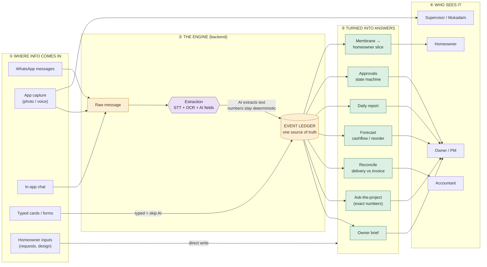

# How Constructo Works Right Now — Roles, Flow & Decision Paths

> **Author:** Written with Claude (grounded in a field-level read of the live backend), 2026-06-09
> **For:** Aryan (founder) — to *see* the whole system and decide which roles to keep, merge, or cut.
> **Reads with:** [EXECUTION-PLAN.md](EXECUTION-PLAN.md), [CIVILARCH-GOLDEN-PATH.md](CIVILARCH-GOLDEN-PATH.md).

---

## TL;DR

- There are **7 roles** in the backend (you guessed "5–6" — close): `owner, pm, supervisor, accountant, procurement, labor_contractor (mukadam), homeowner`. Plus 4 homeowner sub-roles.
- **One of them is already dead** (`procurement` has zero screens — the code itself calls it "a hat, not a seat").
- **Two are thin / overlapping** (`pm` mostly shares the owner's brief; `mukadam` overlaps `supervisor` on capture).
- The whole system has **one spine**: a single **Event Ledger**. Everything flows in, gets structured once, and everything else is a window onto it.
- **Numbers are never produced by AI** — they come from deterministic reducers. AI only extracts text and drafts prose. That's the honest-AI contract, and it's real in the code.

---

## PART A — The roles (who's who, what they do)

Exact enum: `app/models/user.py`. The mobile app routes purely by this `role` (no hidden persona field) — `mobile/app/index.tsx`.

| # | Role (exact value) | Home screen | What they do | Sites they see | Richness | Verdict |
|---|---|---|---|---|---|---|
| 1 | **`owner`** | brief | The boss. Morning brief, approve money, manage team/sites/settings, reconcile, export. **All-powerful baseline.** | **All company** | Very high | **KEEP — core** |
| 2 | **`pm`** | brief / dpr | Project manager. Reads the same brief as owner; the one unique thing is **DPR (daily report) review**. Propose (not approve) decisions. | All company | Low–med | **MERGE candidate** (overlaps owner) |
| 3 | **`supervisor`** | capture | On-site lead. **Photo/voice capture**, action items, site chat, homeowner request inbox. *Free seat.* | Assigned only | Medium | **KEEP — the field** |
| 4 | **`labor_contractor`** (mukadam) | attendance | Marks **crew attendance** → wage proof → faster payment. *Free seat.* Narrow. | Assigned only | Low–med | **CUT for pilot** (re-add for labor-heavy builders) |
| 5 | **`accountant`** | reconcile | Finance. **3-way reconcile** (delivery↔invoice↔payment), payments ledger, Tally export. | Assigned only | Medium | **KEEP / mergeable into owner for small firms** |
| 6 | **`procurement`** | orders | POs / material orders. **Zero dedicated screens** — code marks it "a hat, not a seat." | Assigned only | **Dead** | **CUT — it's already vestigial** |
| 7 | **`homeowner`** | home | The customer. Calm app: requests, design selections, decision responses. Separate theme, never company-scoped. | Own site only | Medium | **KEEP — the customer** |

**Homeowner sub-roles** (`app/homeowner/authority.py`): `primary_owner` + `co_owner` = **approvers** (can approve money/scope, manage members, design). `family` + `advisor` = **read/comment** (design only if granted per-member). This 2-tier model is clean — keep it.

### The capability spine (who can do what)

| Capability | owner | pm | supervisor | mukadam | accountant | procurement | homeowner |
|---|:-:|:-:|:-:|:-:|:-:|:-:|:-:|
| See morning brief | ✓ | ✓ | | | | | |
| **Approve money** | ✓ | | | | | | |
| Propose a decision | ✓ | ✓ | | | ✓ | ✓ | |
| Review/send DPR | ✓ | ✓ | | | | | |
| Reconcile / export | ✓ | | | | ✓ | ✓ | |
| **Capture (photo/voice)** | ✓ | ✓ | ✓ | ✓ | | ✓ | |
| Attendance | ✓ | ✓ | ✓ | ✓ | | | |
| Manage team/sites/settings | ✓ | sites | | | | | |
| Calm "am I okay" view | | | | | | | ✓ |

> Read the columns: `owner` fills nearly every box. `procurement` adds nothing a screen exists for. `pm` and `mukadam` each own essentially **one** unique capability (DPR; attendance).

---

## PART B — How the whole system works (who gives what to whom)

**The mental model: one ledger, many windows.** Everything that happens on site flows *in* through a few doors, gets **structured exactly once** into the Event Ledger, and every screen/report is just a *read* of that ledger.



**The narrative, in plain words:**

1. **Information comes in 5 ways:** WhatsApp messages, app capture (photo/voice), in-app chat, typed cards/forms, and homeowner inputs.
2. **Everything except typed cards and homeowner inputs becomes a "raw message"** and goes through **one extraction pipeline**: voice → speech-to-text, photos/challans → OCR, then a keyword classifier (deterministic) picks the event type and the **AI fills in the fields** (vendor, material, etc.). **Typed cards skip the AI entirely** (confidence 1.0).
3. **It all lands in one Event Ledger** (`SiteEvent`) — the single source of truth. Append-only, versioned, evidence-linked.
4. **Every output is a read of that ledger.** The owner's brief, the exact-number answers, reconciliation, forecasts, the daily report, approvals, and the homeowner's filtered slice — all derived from the same events.
5. **Homeowner inputs are different** — design choices, requests, and decision-responses are written *directly* (no AI), then the crew reviews them.

---

## PART C — Deterministic vs AI vs Chat vs Human (your "which paths are what")

This is the part you asked about most directly. Here's the honest split, from the code:

### 🟢 Deterministic paths (rules / math — always reliable, ~25 operations)
The **spine**. No AI. Auditable, repeatable.
- **Event classification** (keyword → event type)
- **Ask-the-project / exact numbers** — `sum_quantity`, `sum_headcount`, `sum_amount` reducers. **The AI never produces a number.**
- **Reconciliation** — delivery↔invoice matching on (vendor, item, date, ±2%)
- **Forecast** — reorder intervals + cashflow run-rate (pure arithmetic)
- **Risk detection** — heuristic rules (absence 3+ days, unmatched invoices…)
- **Approvals** — the state machine (pending→acknowledged→resolved) + SLA timer
- **Action-item detection** — explicit keyword cues ("bhej do", "remind")
- **The membrane** — stripping vendor/rate/money before anything reaches the homeowner
- **Numeral repair** — "do/paanch" → 2/5 after speech-to-text

### 🟣 AI / LLM paths (drafts & extraction — ~10 operations)
AI is used **only** to turn messy input into text, or to write prose — **never** to compute or decide.
- Speech-to-text + OCR (media → text)
- **Extraction field-fill** (text → structured fields; classifier locks the type)
- Owner-brief prose, daily-report prose, photo captions, weekly summaries (all human-reviewed)
- Semantic search (embeddings)
- Fuzzy question fallback (only when the deterministic path can't answer)

### 🔵 Chat path
In-app chat is a **dual rail**: a chat message is *both* a conversation (stored as `ChatMessage`) *and* fed into the same extraction pipeline (minted as a raw message) so it can become a ledger event. The "capture rail" (slash-commands / typed cards) is the deterministic sibling of the free-text chat rail.

### 🟠 Human-commit gates (~8 — where a person must say "yes")
Nothing important happens silently. A human commits at: confirming a low-confidence extraction, approving money/scope, publishing to the homeowner, sending the DPR, and resolving disputes. **This is the "AI proposes, human commits" doctrine, enforced in code.**

> **The one-sentence truth:** *AI reads and drafts; deterministic code counts and matches; humans approve.* That's your honest-AI moat, and it already works.

---

## PART D — Role-removal analysis (your decision)

You're right to want fewer roles. Here's the founder-level call, tuned to your **CivilArch interior-fit-out pilot** (where the team is Anil = principal, Saurabh/Vikas/Anamika = leads, Pratibha = homeowner):

**Cut now (safe):**
- **`procurement`** — already dead (no screens, "a hat, not a seat"). Remove it from onboarding entirely.
- **`labor_contractor` / mukadam** — *for this pilot.* CivilArch's people are **leads**, not headcount-markers; attendance/wage-proof is a labor-heavy-civil-builder need, not an interior-fit-out one. Re-introduce later for that market.

**Merge / fold:**
- **`pm` → into `owner`** for a small firm where the same person runs the project and approves. Keep the **DPR feature**, just surface it inside the owner experience instead of a separate seat. (Re-split when you sell to a firm with a distinct PM.)
- **`accountant`** — keep if CivilArch has a dedicated accounts person; otherwise fold reconcile/payments into `owner` for the pilot.

**The pilot lands on ~3 active roles + the customer:**
1. **Owner / Admin** (absorbs pm + maybe accountant) — Anil / the firm.
2. **Supervisor / Lead** (absorbs mukadam) — Saurabh, Vikas, Anamika.
3. **Accountant** (only if a real one exists).
4. **Homeowner** — Pratibha / Anil.

### ⚠️ Important: *don't delete the enum — hide the roles.*
The roles are wired into RBAC, migrations, and routing everywhere. Deleting `procurement`/`mukadam`/`pm` from the backend is a risky, destructive migration for zero pilot benefit. The **deterministic, production-grade move** (your doctrine: *converge, don't amputate*) is:

- **Keep the 7-role enum** in the backend.
- **Only onboard / surface the 3–4 roles the pilot needs.** Don't create users with the cut roles; hide their nav.
- Add a simple **"roles offered" config per company** so you can switch labor_contractor/procurement/pm back on for a different customer without a code change.

That gives you the *clean, simple UX* you want now **and** keeps the door open for the labor-heavy market later — no amputation.

---

## APPENDIX 1 — Image-generation prompt (for ChatGPT image / Codex)

> ⚠️ Image models garble dense text. Keep expectations modest, iterate, and prefer the Mermaid diagram in Part B for an accurate, text-perfect version (it renders in Obsidian). Use this prompt for a *poster-style overview*:

```
Create a clean, modern flat-vector system-architecture infographic titled
"Constructo — How It Works". Horizontal left-to-right flow with four labeled
columns and big arrows between them.

COLUMN 1 — "Where info comes in": four stacked rounded cards —
"WhatsApp messages", "App capture (photo/voice)", "In-app chat", "Homeowner inputs".

COLUMN 2 — "The engine": one large rounded panel with a top-to-bottom pipeline —
"Raw message" → "Extraction: speech-to-text + OCR + AI" (small purple robot icon)
→ a database cylinder labeled "EVENT LEDGER — one source of truth".

COLUMN 3 — "Turned into answers": a grid of small color-tagged cards.
GREEN cards (deterministic math): "Reconcile", "Exact numbers", "Forecast",
"Risk detection", "Approvals". PURPLE cards (AI drafts): "Daily report",
"Owner brief", "Semantic search", "Photo captions". One AMBER card: "Human approves".

COLUMN 4 — "Who sees it": person-cards — "Owner / PM", "Supervisor",
"Mukadam", "Accountant", "Homeowner (calm view)". Draw thin arrows from the
relevant Column-3 cards to each role.

LEGEND (bottom-left box): GREEN = Deterministic (rules/math, always reliable);
PURPLE = AI (drafts & extraction only); AMBER = Human approval; BLUE = Chat.

STYLE: minimal flat vector, rounded corners, soft shadows, warm off-white
background (#EFEADF), single marigold accent (#F0A21F), deep-ink text,
generous spacing, large legible sans-serif, no clutter. 16:9.
```

---

## APPENDIX 2 — Key files (so any claim here is checkable)

Roles/RBAC: `app/models/user.py` (enum) · `app/auth/deps.py` (`require_role`) · `app/auth/landing.py` (role→home) · `app/sites/router.py` (`effective_visible_site_ids`) · `mobile/app/index.tsx` (role→route) · `web/src/auth/permissions.ts` · `app/homeowner/authority.py` (sub-roles).
Flow: `app/ingestion/` · `app/capture/` · `app/chat/` · `app/extraction/` (extract, classify, llm, stt, ocr, numeral_repair) · `app/brief/` · `app/agent/` (aggregate) · `app/reconcile/matching.py` · `app/forecast/` · `app/search/` · `app/approvals/state_machine.py` · `app/action_items/detector.py` · `app/publish/membrane.py` · `app/dpr/draft.py` · `app/bot/`.
