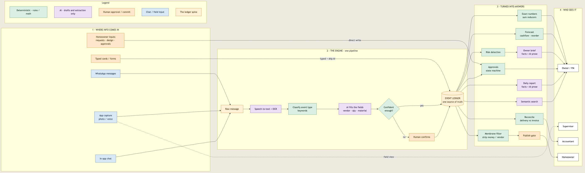
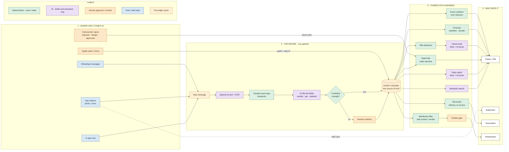
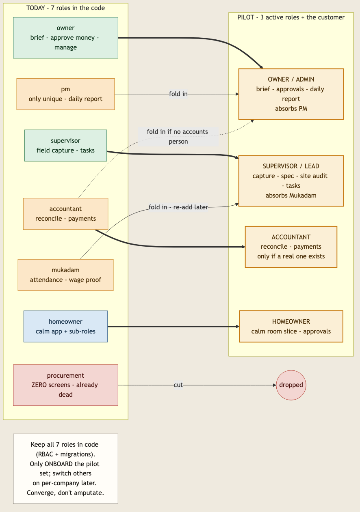
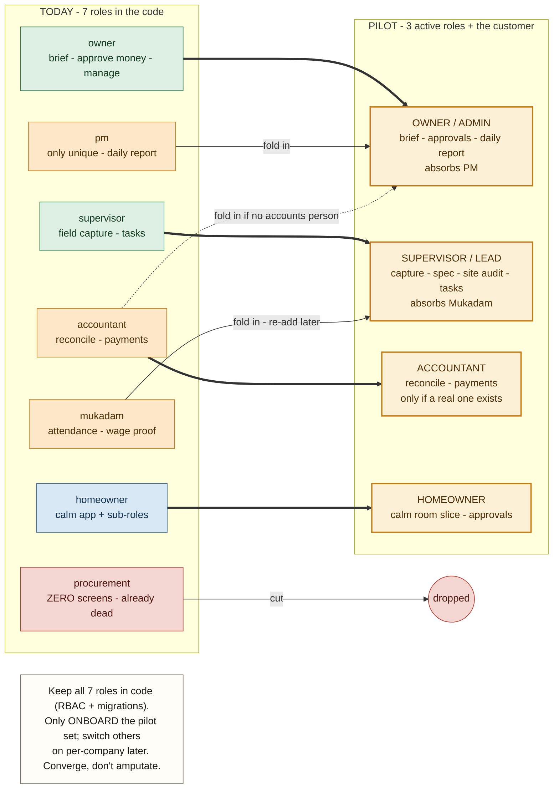

# Constructo — System Flow Diagram

> How the whole system works: where info comes in → the one extraction pipeline → the single Event Ledger → every answer → who sees it. Color-coded by *how* each step is processed.
> Companion to [HOW-IT-WORKS.md](HOW-IT-WORKS.md). Rendered image: `diagrams/system-flow.png`.

**Legend:** 🟢 green = **Deterministic** (rules / math, always reliable) · 🟣 purple = **AI** (drafts & extraction only — never numbers) · 🟠 amber = **Human approval / commit** · 🔵 blue = **Chat / field input** · 🟡 tan = **the Event Ledger spine**.

---

## Roles — keep / merge / cut (for the CivilArch pilot)

> Collapse the *active* surface to **3 roles + the customer**. But keep all 7 in the code (they're wired into RBAC + migrations) — just onboard fewer, and flip the rest on per-company later. **Converge, don't amputate.**
>
> 🟢 keep · 🟠 merge / fold in · 🔴 cut (already dead) · 🔵 customer · tan = pilot target.

